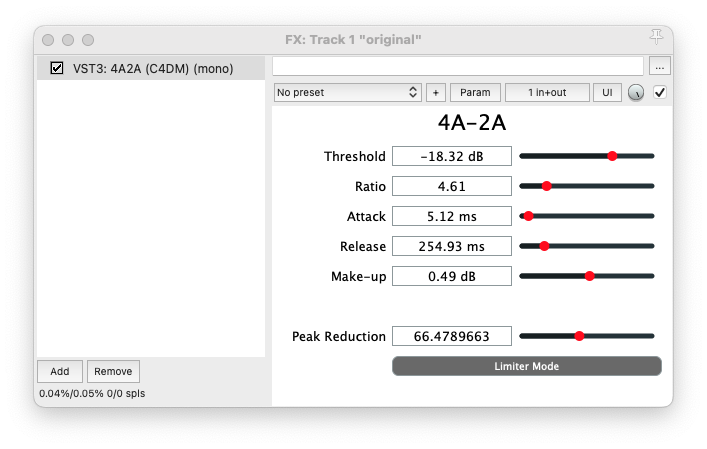

# 4(Feed-Forward)A-2A: an emulator plugin for LA-2A optical compressor

4A-2A is a VST plugin that emulates the LA-2A optical compressor using a feed-forward digital compressor.
It was first presented as [Emulating LA-2A Optical Compressor With a Feed-Forward Digital Compressor Using the Newton-Raphson Method](media/DMRN_19__4A_2A.pdf) at DMRN+19.
The finished work, [Sound Matching an Analogue Levelling Amplifier Using the Newton-Raphson Method](), was accepted at the AES International Conference on Artificial Intelligence and Machine Learning for Audio in London, UK.

We implement a mapping function $\mathbb{R} \to \mathbb{R}^5$ that maps the peak reduction of the LA-2A to the five parameters of the feed-forward compressor. The mapping function is learnt using the Newton-Raphson method on the [SignalTrain](https://doi.org/10.5281/zenodo.3824876) dataset.

## Interface



The plugin comes with six sliders and one button, which are:

1. `Threshold` - The threshold of the compressor in dB.
2. `Ratio` - The ratio of the compressor (1 to 20).
3. `Attack` - The attack time of the compressor in ms (0.1 to 100).
4. `Release` - The release time of the compressor in ms (100 to 1000).
5. `Make-up` - The make-up gain of the compressor in dB.
6. `Peak Reduction` - The emulated peak reduction of the LA-2A (40 to 100). This slider controls the other five sliders and overrides their values.
7. `Comp./Limit.` - The mode of the compressor. When the button is changed, sliders 1-5 are also changed based on the peak reduction.

## Installation

The pre-built VST3 binaries for Windows and macOS can be found in the [releases](https://github.com/aim-qmul/4a2a/releases).
One can also build the plugin from source using the [Projucer](https://juce.com/download/) project file.

## Training code

The source code of the papers is implemented in Python and is listed in the [python](python/) directory.
For details, please refer to the [README](python/README.md) file in the directory.

## Citation
If you use this plugin in your research, please consider citing the following papers:

```bibtex
@inproceedings{yu2024emulating,
  title={Emulating LA-2A Optical Compressor With a Feed-Forward Digital Compressor Using the Newton-Raphson Method},
  author={Chin-Yun Yu and György Fazekas},
  booktitle={Proceedings of the Digital Music Research Network Workshop},
  year={2024}
}

@inproceedings{ycy2025Newtone,
  title={Sound Matching an Analogue Levelling Amplifier Using the Newton-Raphson Method},
  author={Chin-Yun Yu and György Fazekas},
  booktitle={AES International Conference on Artificial Intelligence and Machine Learning for Audio},
  address={London, UK},
  year={2025},
}
```
